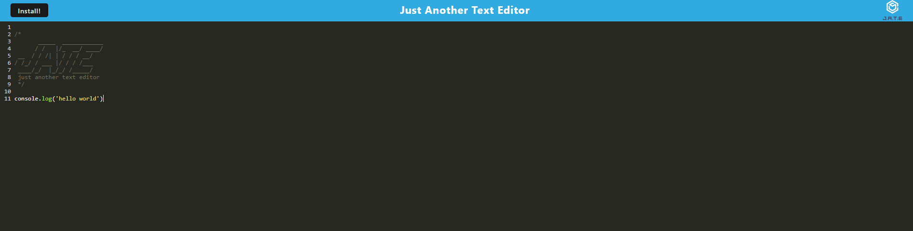

# PWA-Text-Editor


## Description
 This is a simple text editor app that is used to create code snippets or notes that are automatically saved and accessible for viewing or editing whether your connected to the internet or not. This app is fully functional offline and can also be installed on your desktop or mobile device.

vist the deployed app here:
https://pwa-jate0.herokuapp.com/




## Table of Contents

* [Installation](#installation)
* [Usage](#usage)
* [License](#license)


## Installation
clone the repo and have node.js installed to run the app locally.


To install the dependencies, run the following command:

```
npm i
```

## Usage

To start the app, run the following command:

```
npm start
```

## License

MIT License